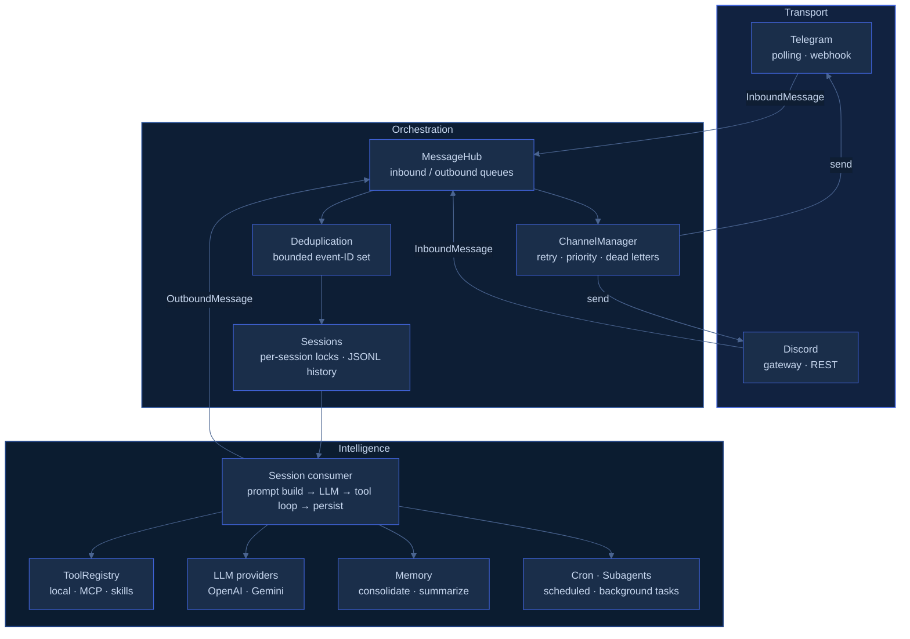
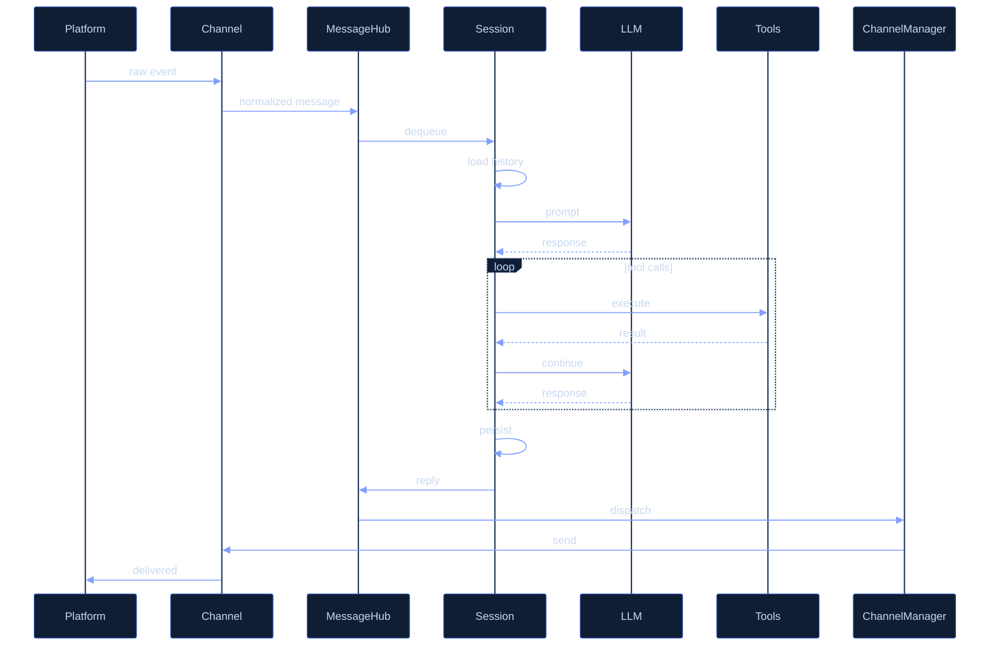
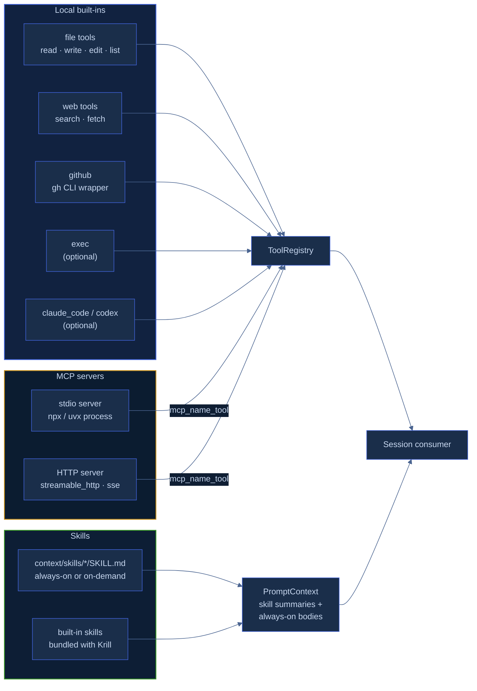

# Architecture

A message comes in from Telegram or Discord, gets processed by an LLM with tools, and a reply goes back out. Everything in between is Krill.

## System Layers

## Message Flow

## Tool Assembly

## Core Components

### `Types`

The runtime boundary types shared by all subsystems:

- `InboundMessage`, `OutboundMessage`
- content parts: `TextPart`, `BinaryPart`, `ToolCallPart`, `ToolResultPart`
- `DeliveryPolicy`, `ErrorEnvelope`
- tool lifecycle events

### `MessageHub`

`MessageHubState` decouples producers from consumers.

- inbound channel for normalized user/platform events
- outbound channel for generated replies or tool-originated messages
- blocking and non-blocking APIs for backpressure-aware wiring

### `ChannelManager`

`ChannelManagerState` owns outbound dispatch.

- sender registration by channel symbol
- retry / timeout / priority / `drop_if_late`
- dead-letter capture
- dispatch events and counters

### `ChannelInterface`

`AbstractChannel` keeps integrations minimal: identify, normalize, send, start/stop.

### `Sessions` and `Memory`

Session history and durable assistant memory are separated on purpose.

- `SessionStore` writes ordered turn history to JSONL
- `MemoryStore` writes `MEMORY.md`, `HISTORY.md`, and `state.json`
- the memory consolidator periodically compresses durable facts out of long histories

### `Tools`, `Skills`, and `MCP`

The intelligence surface is layered rather than monolithic.

- `ToolRegistry` holds local tool definitions and validation
- skills provide markdown instructions — always-on or on-demand via `read_skill`
- MCP connections discover external tools and register them into the same registry

**Note:** Julia has no official MCP SDK. Krill's MCP client (`src/core/mcp.jl`) implements JSON-RPC initialize / list / call over stdio and HTTP from scratch. It covers common cases well but may have edge-case issues with unusual servers. See [Known Limitations](/guide/features#Known-Limitations).

### `PromptContext`

Krill composes the instruction stack explicitly on every turn:

1. base system prompt
2. workspace bootstrap docs (`SOUL.md`, `AGENTS.md`, `USER.md`, `TOOLS.md`)
3. skill metadata summary
4. always-on skill bodies
5. session memory
6. tool-output safety notice
7. runtime metadata (channel, session key, chat ID, UTC timestamp)

### `LLM`

- OpenAI Responses API payloads
- Gemini native `generateContent`
- Gemini OpenAI-compatible chat completions
- context-window trimming and dropped-history summarization
- tool call extraction and continuation loops

### `Cron` and `Subagent`

Both inject work back into the same runtime rather than creating a separate orchestration layer.

- cron jobs publish synthetic inbound messages back into `MessageHub`
- subagents run in isolated sessions and inject a summarized result into the origin conversation

## `RuntimeState` — Composition Root

`RuntimeState(...)` is where the whole stack is assembled: channels, tool registry, MCP connections, prompt builder, LLM processor, memory hooks, cron, and subagents. Startup and shutdown are owned here.

## Filesystem Layout

### Agent file sandbox (`<project>/context`)

| Path | Owned by | Purpose |
| --- | --- | --- |
| `SOUL.md`, `AGENTS.md`, `USER.md`, `TOOLS.md` | Prompt context | bootstrap docs injected into system prompt |
| `skills/` | Skills loader | context-local skill definitions |

The agent can read and write inside this directory. File tools are restricted to it by default.

### Krill internal state (`~/.krill`)

| Path | Owned by | Purpose |
| --- | --- | --- |
| `sessions/.../history.jsonl` | `SessionStore` | ordered user/assistant turns |
| `memory/.../MEMORY.md` | `MemoryStore` | consolidated durable memory |
| `memory/.../HISTORY.md` | `MemoryStore` | archived consolidation batches |
| `memory/.../state.json` | `MemoryStore` | consolidation offsets and failures |
| `cron/jobs.json` | `CronService` | persisted schedules |
| `dead_letters.jsonl` | `ChannelManager` | failed dispatch records |

Krill manages this directory itself — it is never exposed to the agent's file tools.

